# Paster v1.4.0 发布：12套剪贴板外观 + 截图·录屏·OCR·翻译，工具栏也能自定义了！

**Paster** 是 Windows 上的剪贴板增强工具 —— 自动记录你复制过的所有内容，还能**截图、录屏、OCR 文字识别、离线翻译**。全部本地运行、**免费、隐私安全**。

自 v1.3.0 以来收到了很多用户的反馈和意见，我们一路迭代到 v1.4.0，加了不少硬货。先看清它能干嘛，再看脸，最后看更新 👇

---

## 一、它能帮你做什么？（能力速览）

| | |
|---|---|
| 📋 **剪贴板历史** 自动记录文本 / 图片 / 文件 / 链接，永不丢失 | 📷 **截图标注** 矩形 / 箭头 / 马赛克等丰富标注工具 |
| 🎬 **屏幕录制** 区域录屏，录制中可拖拽调整范围 | 🔍 **文字识别 OCR** 框选即识别，结果可复制、可翻译 |
| 🌐 **离线翻译** 内置引擎，右键即译、不上传 | 📝 **便签贴图** 钉到桌面，纸色 / 倾斜角度可调 |
| 🔗 **局域网共享** 多设备互传剪贴板内容 | 🎨 **12 套外观** 卡片 / 看板 / 时间线…随心换 |

---

## 二、12 套外观，总有一款合你眼缘

复制历史不再只有一种样子。v1.4.0 起内置 **12 套外观窗口**，从极简到信息流，从视觉到效率，挑你顺眼的那款：

| | |
|---|---|
| 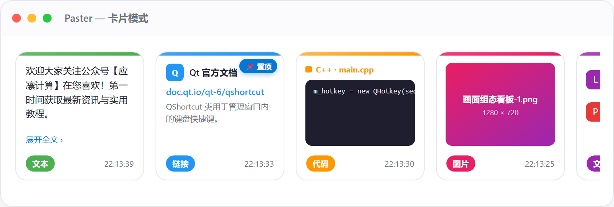 **卡片模式** — 经典网格，信息一目了然 | 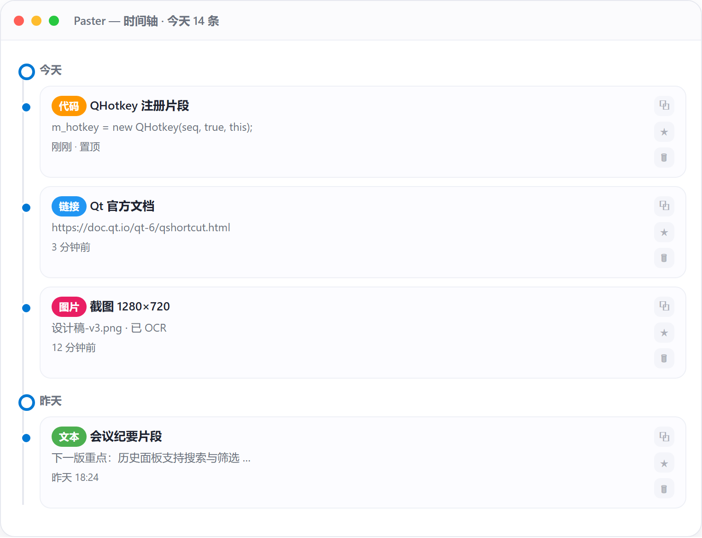 **时间线** — 按时间轴展开，回顾复制轨迹 |
| 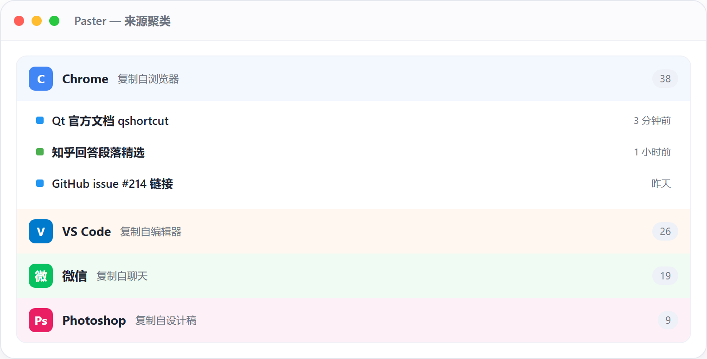 **来源视图** — 按应用来源分组，追溯出处 | 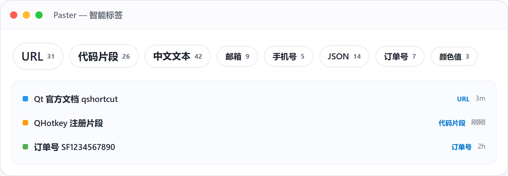 **标签视图** — 自定义标签归类，找内容更快 |
| 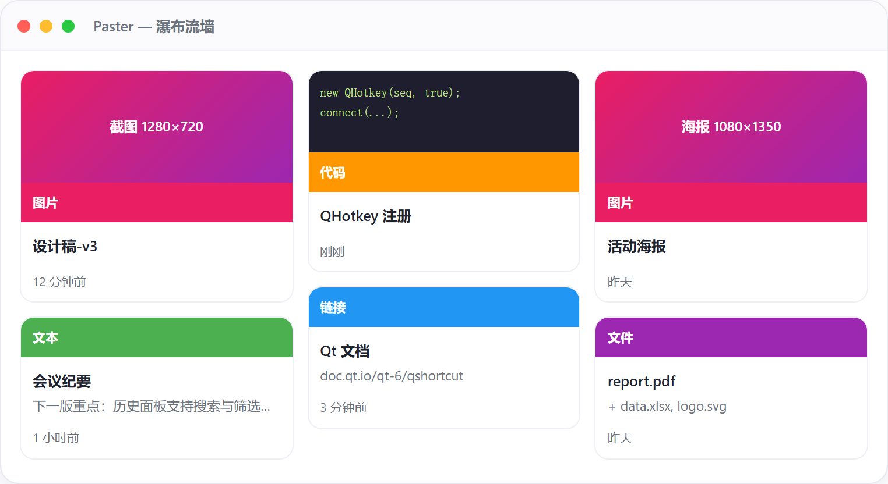 **瀑布流** — 错落排布，空间利用率高 | 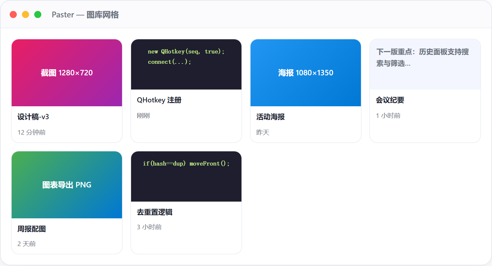 **画廊视图** — 图片墙式浏览，视觉清爽 |
| 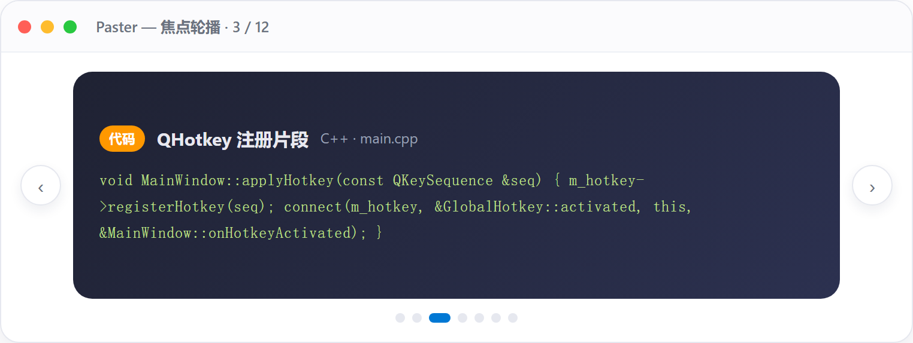 **轮播视图** — 大图轮播，看图居多时更爽 | 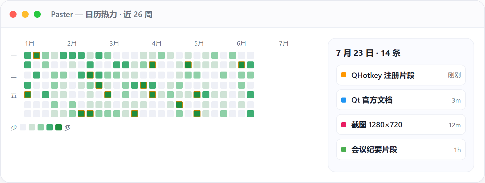 **热力视图** — 按使用频率着色，常用的更突出 |
| 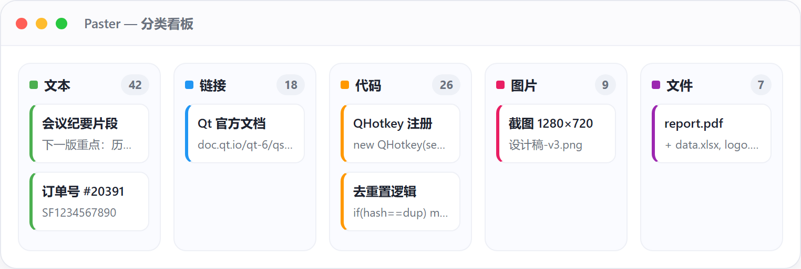 **看板视图** — 拖拽分类，像任务看板一样整理 | 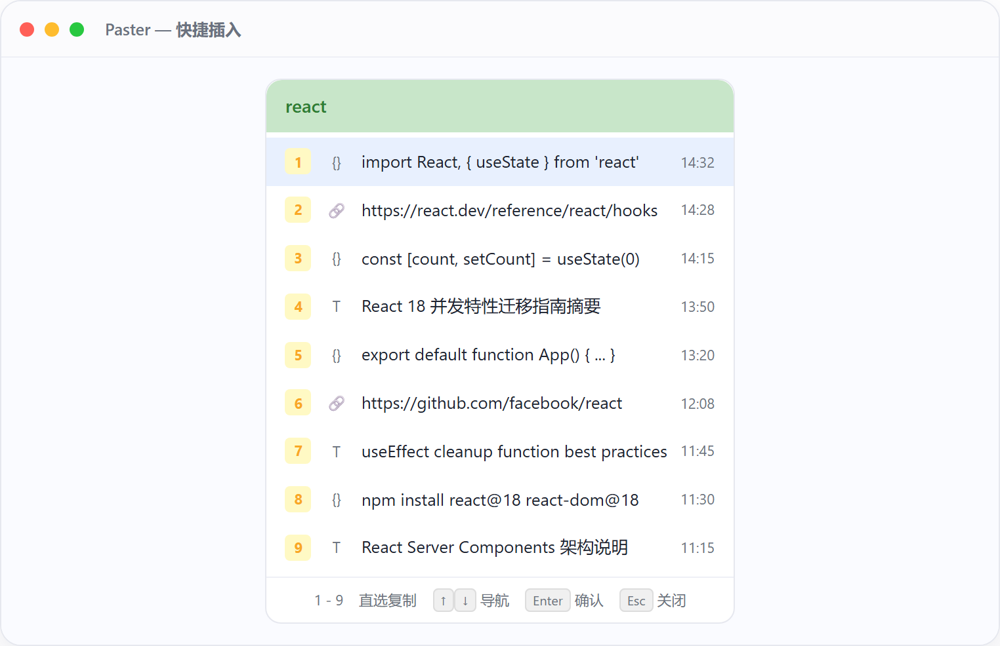 **快捷插入** — 极简工具条，复制即贴 |
| 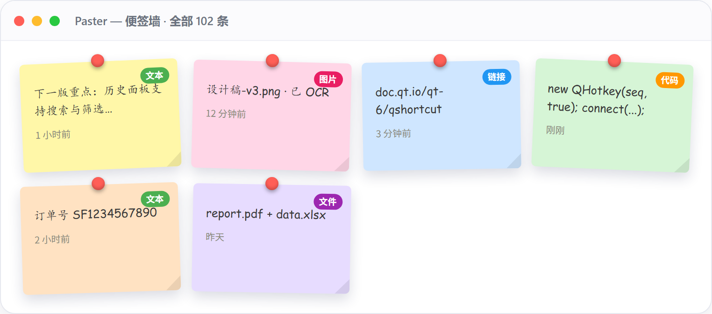 **便签视图** — 把常用片段钉成便签 | 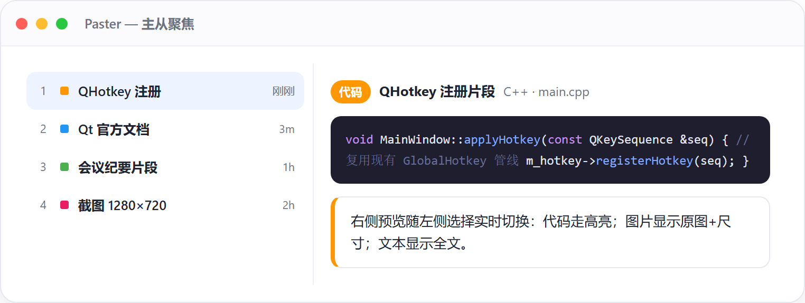 **总览视图** — 多维度汇总，一屏掌握全局 |

> 12 套外观共用同一套数据与快捷键，切换只是换个「皮肤」，内容不乱。

---

## 三、v1.3.0 以来的重要更新

### 🧰 工具栏自定义（v1.4.0）
12 套外观共用的顶部工具栏，现在**完全由你定义**：想留哪些按钮、排什么顺序，自己说了算。
- 自带「模拟工具栏」**所见即所得**：候选区拖入即启用，工具栏内拖拽即可排序（蓝色插入线提示落点）。
- 老版本已保存的配置**自动兼容**，无需手动重置。

### 🪟 12 套外观体系（v1.3.9）
在原来的「卡片模式 / 快捷插入」之外，一口气新增 **10 套历史查看外观**（便签墙、来源聚类、日历热力、瀑布流、图库网格、焦点轮播、主从聚焦、分类看板、时间轴流、智能标签），每套支持独立参数，快捷键均可自定义，外观还在不断迭代和美化中，欢迎反馈意见。

### 📷 截图 · 🎬 录屏 · 🔍 OCR · 🌐 翻译（v1.3.2 ~ v1.4.0）
- **截图**：智能防遮挡、双屏精准采集、ESC 取消选择（v1.3.2）；双屏下工具栏位置修正（v1.3.8），标注工具齐全。
- **录屏**：录制中可拖拽调整区域（v1.3.7）；未装 FFmpeg 时改为友好提示而非卡死（v1.3.8）。
- **OCR**：识别结果窗点「复制并关闭 / ×」时**同步退出截图**，不再残留选区与遮罩（v1.4.0）。
- **翻译**：离线翻译引擎稳定性增强，卡片 / OCR 结果 / 阅读模式右键即译（v1.3.5 架构统一）。

### ✅ 更多实用更新
- 卡片模式新增「**全选**」+ 快捷键 **Ctrl+A**，批量操作更高效（v1.4.0）。
- 托盘**左键单击**唤起的窗口可自定义，12 套外观任选（默认仍是卡片模式）（v1.4.0）。
- **收藏与置顶拆分**，可单独收藏不影响置顶（v1.3.7）。
- 新增**数据清理**对话框，可分项清理历史 / 收藏 / 便签 / 缓存（v1.3.7）。
- **桌面贴图**增强：不透明度滑块调节、一键隐藏 / 显示（v1.3.9）。
- 复制时自动记录**来源应用**，按来源聚类查看（v1.3.9）。
- **设置面板重组** + 性能优化，大历史量热键唤起更流畅（v1.3.9）。

---

## 四、怎么用上新版？

- 📦 下载安装包：[PasterInstallerV1.4.0.exe](https://gitee.com/aiexporter/paster/releases/download/v1.4.0/PasterInstallerV1.4.0.exe)
- 🌟 项目主页：[gitee.com/aiexporter/paster](https://gitee.com/aiexporter/paster)（觉得好用别忘了 Star 支持一下）

升级后旧数据不受影响，直接覆盖安装即可。

---

> **关于 Paster**：纯为爱发电、永久免费。软件在本地运行，剪贴板数据不上传，隐私安全放心用。
> 使用中遇到 Bug 或有功能建议，欢迎随时留言反馈，我们会持续打磨。
> 关注公众号 **【边缘计算组态仿真软件】**，第一时间获取最新版本与实用教程。
